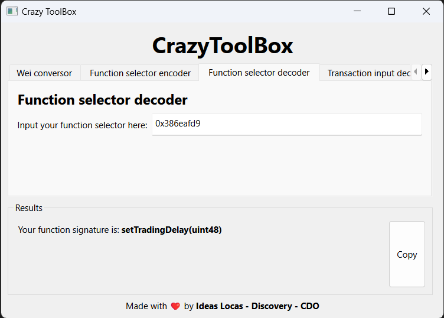

<h1 align="center">CrazyToolBox</h1>

#### Table of contents

- [📢 What is _CrazyToolBox_?](#-what-is-crazytoolbox)
- [⚙️ Execution](#️-execution)
- [⭐ Current features](#-current-features)

</br>

## 📢 What is _CrazyToolBox_?

_CrazyToolBox_ is a collection of usefult tools relative to Web3. These tools can be accessed through a GUI using the _CrazyToolBox_ application.

We will be adding new tools to the _CrazyToolBox_ as we develop them. For now, the tools available are described below in the [Current features](#-current-features) section.

<div align="center">
    
</div>

## ⚙️ Execution

_CrazyToolBox_ can be executed using `pipenv`. First, you must install `pipenv`. Then, on the root directory of the project, the dependencies are installed and the virtual environment is activated:

```bash
pipenv install
pipenv shell
```

Finally, the toolkit can be executed by running:

```bash
python main.py
```

## ⭐ Current features

<details>
    <summary>Wei Converter</summary>
    <p>Converts between Wei, Gwei, Ether and other Ethereum units with our advanced mode (2 modes available). Supports until 30 floating point decimals.</p>
    <div align="center">
        
        
    </div>
</details>

<details>
    <summary>Function selector encoder</summary>
    <p>Encodes a function selector from a function name and its parameters or from a function signature. (2 modes available)</p>
    <div align="center">
        
        
    </div>
</details>

<details>
    <summary>Function selector decoder</summary>
    <p>Decodes a function selector to a function signature (thanks to <a href="https://www.4byte.directory/">4byte.directory</a> open API).</p>
    <div align="center">
        
    </div>
</details>

<details>
    <summary>Transaction input decoder</summary>
    <p>Decodes the input of a transaction to a function signature and its parameters without the need of the ABI.</p>
    <div align="center">
        
    </div>
</details>

<details>
    <summary>Keccak256 hash calculator</summary>
    <p>Calculates the Keccak256 hash of a string.</p>
    <div align="center">
        
    </div>
</details>

<details>
    <summary>EIP55 validator</summary>
    <p>Validates if an Ethereum address is EIP55 compliant. Also checks if the checksum is correct, if not, fixes it and returns the correct address.</p>
    <div align="center">
        
    </div>
</details>

<details>
    <summary>Signature owner</summary>
    <p>Returns the owner of a signature. To use it, you must provide the signature and the message (or hash) that was signed.</p>
    <div align="center">
        
    </div>
</details>

<div align="center">
    <b> Stay tuned for more features! </b>
</div>

</br>
<hr>
</br>

<div align="center">
    This software doesn't have a QA process and is a Proof of Concept.
    </br>
    If you have any problems, you can contact: <a href="mailto:ideaslocas@telefonica.com">ideaslocas@telefonica.com</a>
</div>
